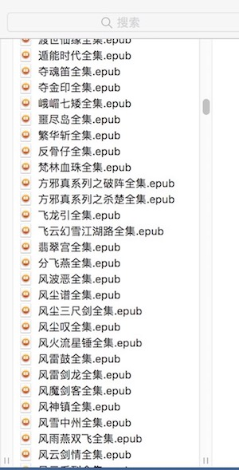
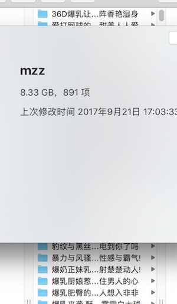

# PythonStore

> 运行环境为 Python 3

> 如果没有安装，[点这里](install.md)

> 如果报错，请自行配置相关环境及确保添加了
requests 和 BeautifulSoup 等相关库

#### 武侠小说 [https://www.ixdzs.com](https://www.ixdzs.com)

* Clone 到本地，切到 Resource 目录下，运行 `python3 wuxia.py` 

---

#### Meizi [http://www.meizitu.com](http://www.meizitu.com)
* Clone 到本地，打开 Resource/meizi.py ，修改 MzituDir 路径
* 终端 切到 Resource 目录下，运行 `python3 meizi.py` 

### 注意
仅供学习研究，禁止商业使用。

### License	

[MIT license](LICENSE)
